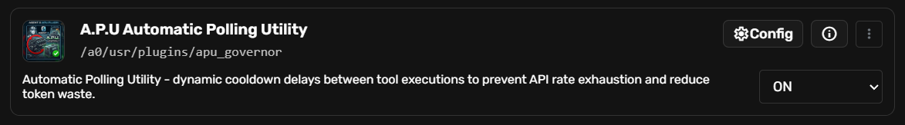
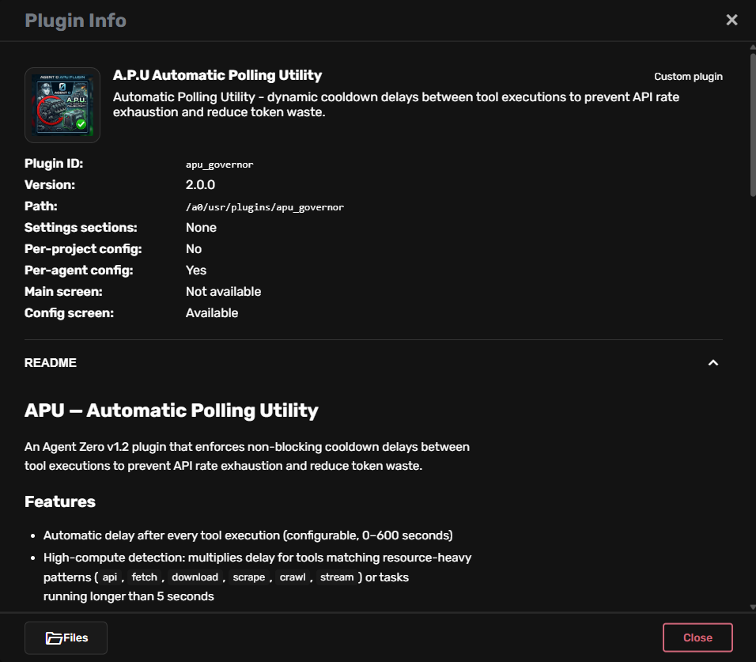
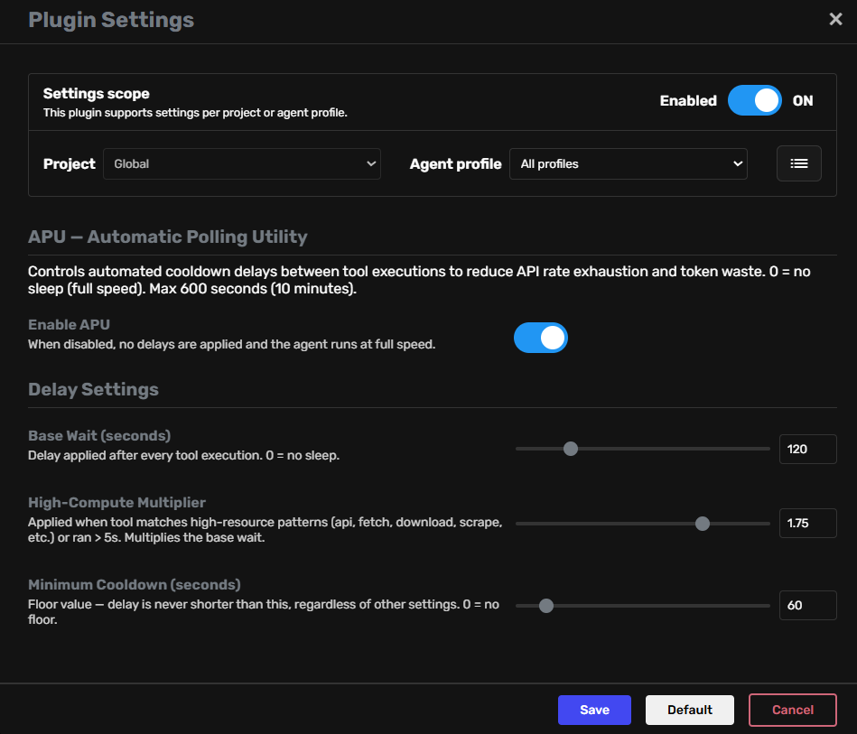
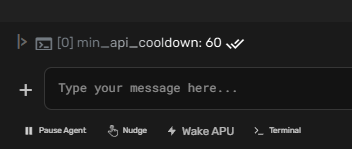
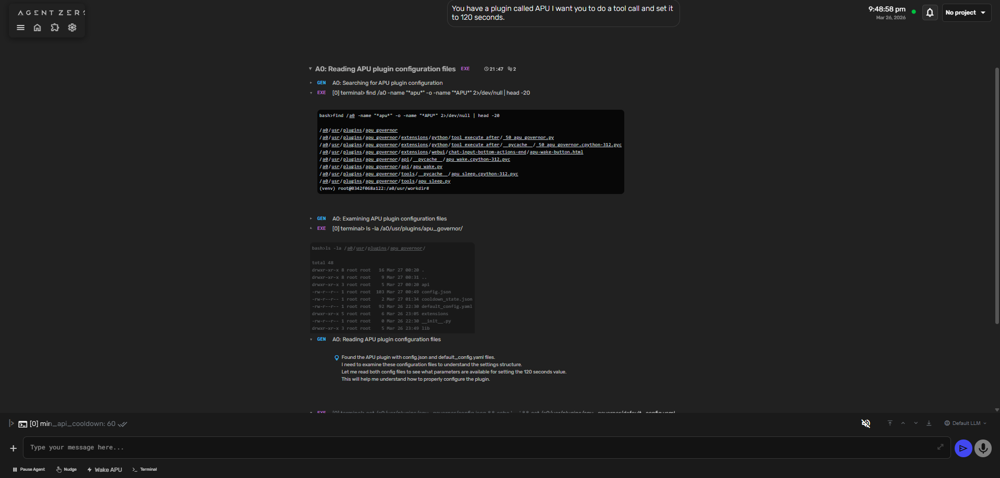
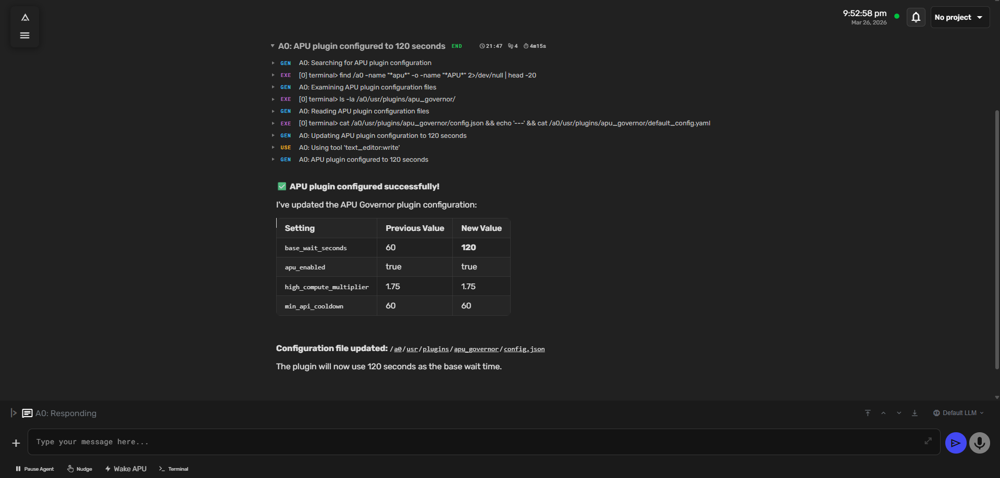
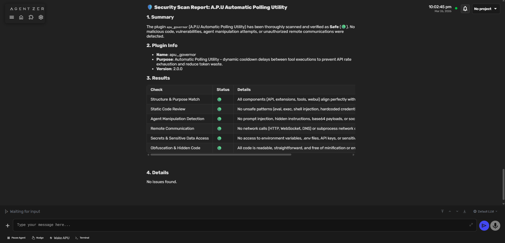

# A.P.U — Automatic Polling Utility
### An Agent Zero v1.2 Plugin by MrTrench / CONTAK


<p align="center">
  
</p>

---

## The Problem

Agent Zero has no native rate throttle. The tool loop runs at full speed — rapid-fire API calls, back to back, no pause. On paid plans, that burns your quota in minutes. On **free-tier or rate-limited API keys**, it's even worse: the API needs time to "recharge" between calls, but Agent Zero doesn't know that. It keeps firing, gets 429s, and either crashes or wastes retries in a tight loop.

Whether you're on a budget plan, a free-tier LLM key, or a provider with strict RPM limits — the agent will find your ceiling and slam into it repeatedly until something breaks.

## The Solution

**APU Governor** intercepts every `tool_execute_after` hook and enforces a configurable, non-blocking cooldown between tool executions. The agent sleeps between actions instead of hammering the API. You control how long. You can wake it instantly when you need speed. Cooldown state survives container restarts.

**It works especially well with free-tier API keys** that enforce a per-minute or per-day request quota — APU paces the agent so it naturally stays inside the recharge window instead of blowing past it.

Think of it as cruise control for your agent's API usage.

---

## Features

- **Configurable base wait** 0–600s via slider in the Agent Zero settings panel
- **High-compute detection** — tool name pattern matching (`api`, `fetch`, `download`, `scrape`, `crawl`, `stream`) OR runtime > 5 seconds triggers the multiplier
- **High-compute multiplier** 1.0–2.0x applied automatically when a heavy tool is detected
- **Minimum cooldown floor** — effective delay = `max(base_wait × multiplier, min_cooldown)` — guaranteed baseline rate
- **Non-blocking** — `asyncio.sleep` yields to the event loop; agent stays alive and responsive during waits
- **Interruptible** — polls every 1 second, exits cooldown immediately on Wake signal
- **⚡ Wake APU button** — lightning bolt in the chat input bar clears all active cooldowns instantly
- **Restart-persistent** — cooldown state saved to `cooldown_state.json`, loaded on startup, expired entries discarded automatically
- **Full config UI** — sliders + numeric inputs in the Agent Zero plugin settings panel
- **Per-agent config** support — different timing per agent profile
- **Zero external dependencies** — pure stdlib + Agent Zero internals only
- MIT License

---

## Screenshots

<table>
<tr>
  <td align="center"><br/><em>APU installed and active in the plugin manager</em></td>
  <td align="center"><br/><em>Plugin info panel — v2.0.0, per-agent config available</em></td>
</tr>
<tr>
  <td align="center"><br/><em>Settings panel — enable toggle, base wait slider, multiplier, min cooldown</em></td>
  <td align="center"><br/><em>⚡ Wake APU button in the chat toolbar — clears cooldown immediately</em></td>
</tr>
<tr>
  <td align="center"><br/><em>Agent Zero reading and applying APU configuration mid-session</em></td>
  <td align="center"><br/><em>Agent reconfiguring APU timing — before/after comparison table</em></td>
</tr>
<tr>
  <td colspan="2" align="center"><br/><em>Independent security scan — all 6 checks passed: no injection, no network calls, no hardcoded secrets</em></td>
</tr>
</table>

---

## How It Works

### Extension Hook

APU registers as a `tool_execute_after` extension at priority `_50` (runs after all standard post-tool hooks). Every time Agent Zero finishes executing a tool, this fires:

```python
# extensions/python/tool_execute_after/_50_apu_governor.py

class APUGovernor(Extension):
    async def execute(self, tool_name="", response=None, **kwargs):
        config = plugins.get_plugin_config("apu_governor", self.agent)
        if not config.get("apu_enabled", True):
            return
        # ... cooldown check, high-compute detection, interruptible delay
```

### High-Compute Detection

A tool is flagged as high-compute if its name matches any resource-heavy pattern, or if the last execution took longer than 5 seconds:

```python
HIGH_RESOURCE_PATTERNS = ["download", "scrape", "crawl", "api", "fetch", "stream"]
LONG_TASK_THRESHOLD_SECONDS = 5

is_high_compute = any(p in tool_name.lower() for p in HIGH_RESOURCE_PATTERNS)
execution_time = getattr(self.agent, "last_tool_runtime", 0) or 0
if execution_time > LONG_TASK_THRESHOLD_SECONDS:
    is_high_compute = True
```

### Delay Calculation

```python
base_delay = config.get("base_wait_seconds", 300)
multiplier = config.get("high_compute_multiplier", 1.75) if is_high_compute else 1.0
final_delay = int(base_delay * multiplier)

# Enforce bounds
min_cooldown = config.get("min_api_cooldown", 60)
final_delay = max(final_delay, min_cooldown)
final_delay = min(final_delay, MAX_DELAY_SECONDS)  # hard cap: 3600s
```

**Example:** `base_wait=300`, high-compute tool detected → `300 × 1.75 = 525s`. Min floor=60s → effective delay = **525 seconds**.

### Interruptible Sleep

The agent doesn't block the event loop — it wakes every second to check for a cancel signal:

```python
async def _interruptible_sleep(seconds, agent_id, state):
    deadline = time.time() + seconds
    while time.time() < deadline:
        await asyncio.sleep(1)
        if state.wake_requested:
            state.wake_requested = False
            break
        if agent_id and state.cooldown_store.get(agent_id, -1) == 0:
            break
```

### Wake API

The ⚡ Wake APU button calls `POST /plugins/apu_governor/apu_wake`. The handler zeroes all active cooldowns and sets a global wake flag — anonymous agents without an assigned ID are also woken:

```python
# api/apu_wake.py
async def process(self, input: dict, request: Request) -> dict:
    for key in list(cooldown_store.keys()):
        cooldown_store[key] = 0
    _state.wake_requested = True
    _state.save()
    return {"ok": True, "cleared": count}
```

The sleep loop picks up `wake_requested = True` on its next 1-second tick and exits immediately.

### State Persistence

`lib/state.py` maintains a module-level dict — one shared instance per Python process, shared across all agents. On every cooldown update it serializes to `cooldown_state.json`. On import, expired entries are silently discarded:

```python
def _load():
    if _STATE_FILE.exists():
        data = json.loads(_STATE_FILE.read_text())
        now = time.time()
        for k, v in data.items():
            if isinstance(v, (int, float)) and v > now:
                cooldown_store[k] = v   # only keep live cooldowns
```

Pure stdlib — `json`, `time`, `pathlib`. No external packages required.

---

## Configuration Reference

| Setting | Default | Range | Description |
|---|---|---|---|
| `apu_enabled` | `true` | bool | Master on/off switch. Disabled = full speed, no delays. |
| `base_wait_seconds` | `300` | 0–600 | Base delay after every tool call |
| `high_compute_multiplier` | `1.75` | 1.0–2.0 | Multiplier for high-resource tools |
| `min_api_cooldown` | `60` | 0–600 | Minimum cooldown floor in seconds |

All settings are configurable live from the Plugin Settings panel. Changes take effect on the next tool execution — no restart required.

---

## Installation

### Quick Install

1. Download `apu_governor_v2.0.0.zip` from the [Releases page](../../releases).
2. Extract and copy the `apu_governor/` folder into your Agent Zero plugins directory:
   ```
   <agent-zero-data>/usr/plugins/apu_governor/
   ```
3. Restart Agent Zero (or reload plugins from the UI).
4. Plugin is pre-enabled (`.toggle-1` included). Open Plugin Settings to adjust timing.

### Docker

For persistence across container recreates, mount your plugins directory as a volume:

```yaml
# docker-compose.yml
volumes:
  - ./plugins:/a0/usr/plugins
```

The `cooldown_state.json` file lives inside the plugin folder — it persists as long as the volume does.

### From Source

```bash
git clone https://github.com/MrTrenchTrucker/apu-governor.git
cp -r apu-governor/apu_governor/ /path/to/agent-zero/usr/plugins/
```

---

## Plugin Structure

```
apu_governor/
├── plugin.yaml                               # Plugin manifest — name, version, author
├── default_config.yaml                       # Default settings loaded on first install
├── config.json                               # Runtime config (written by settings panel)
├── README.md                                 # This file
├── LICENSE                                   # MIT License
├── .toggle-1                                 # Pre-enables plugin on first load
├── api/
│   └── apu_wake.py                           # POST /plugins/apu_governor/apu_wake
├── extensions/
│   ├── python/
│   │   └── tool_execute_after/
│   │       └── _50_apu_governor.py           # Core hook — fires after every tool execution
│   └── webui/
│       └── chat-input-bottom-actions-end/
│           └── apu-wake-button.html          # ⚡ Wake APU button in chat toolbar
├── lib/
│   └── state.py                              # Shared cooldown store with disk persistence
├── tools/
│   └── apu_sleep.py                          # Agent-callable sleep tool (optional)
└── webui/
    ├── config.html                           # Settings UI with sliders + inputs
    └── thumbnail.png                         # Plugin thumbnail
```

---

## License

MIT License — Copyright (c) 2026 MrTrench / CONTAK

Permission is hereby granted, free of charge, to any person obtaining a copy of this software and associated documentation files (the "Software"), to deal in the Software without restriction, including without limitation the rights to use, copy, modify, merge, publish, distribute, sublicense, and/or sell copies of the Software, and to permit persons to whom the Software is furnished to do so, subject to the following conditions:

The above copyright notice and this permission notice shall be included in all copies or substantial portions of the Software.

THE SOFTWARE IS PROVIDED "AS IS", WITHOUT WARRANTY OF ANY KIND, EXPRESS OR IMPLIED, INCLUDING BUT NOT LIMITED TO THE WARRANTIES OF MERCHANTABILITY, FITNESS FOR A PARTICULAR PURPOSE AND NONINFRINGEMENT. IN NO EVENT SHALL THE AUTHORS OR COPYRIGHT HOLDERS BE LIABLE FOR ANY CLAIM, DAMAGES OR OTHER LIABILITY, WHETHER IN AN ACTION OF CONTRACT, TORT OR OTHERWISE, ARISING FROM, OUT OF OR IN CONNECTION WITH THE SOFTWARE OR THE USE OR OTHER DEALINGS IN THE SOFTWARE.

---

*Built by MrTrench / CONTAK*
